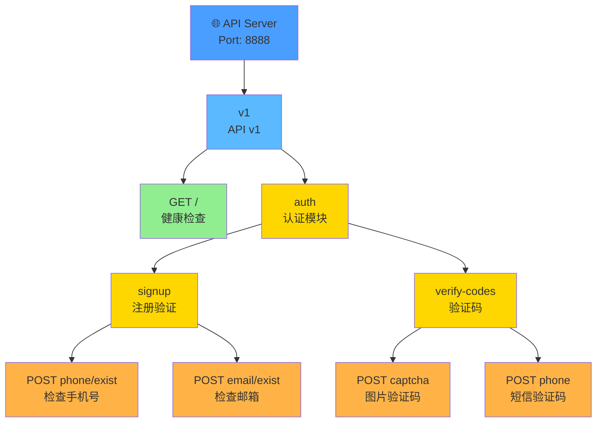
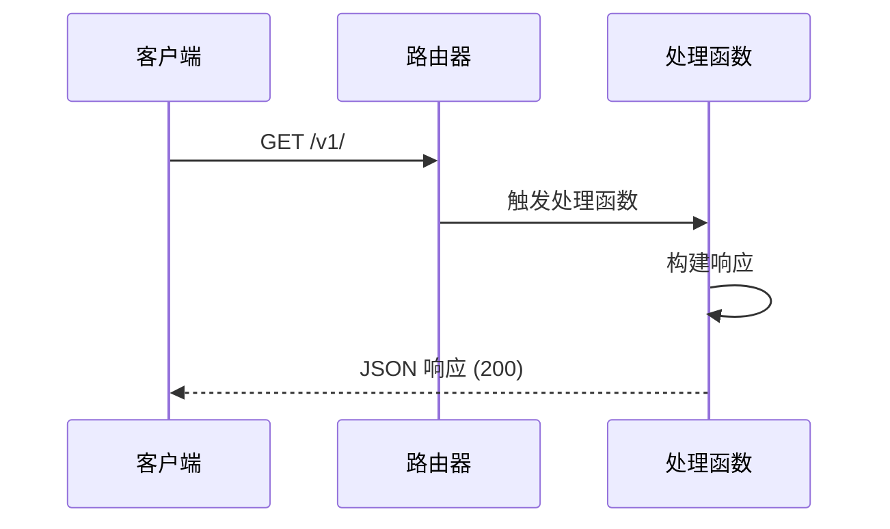
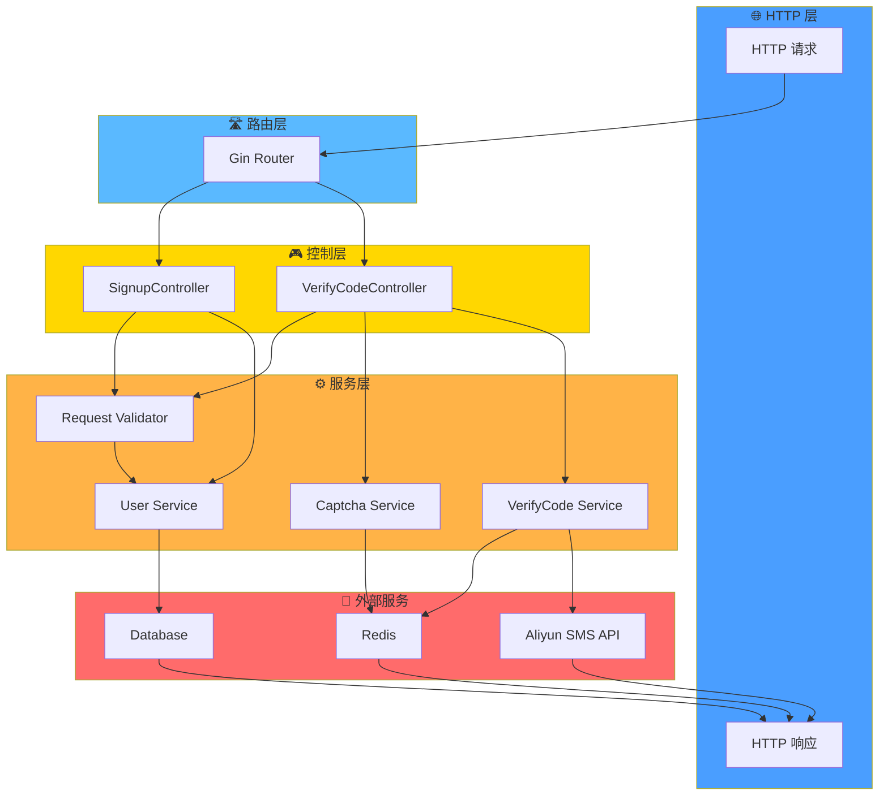
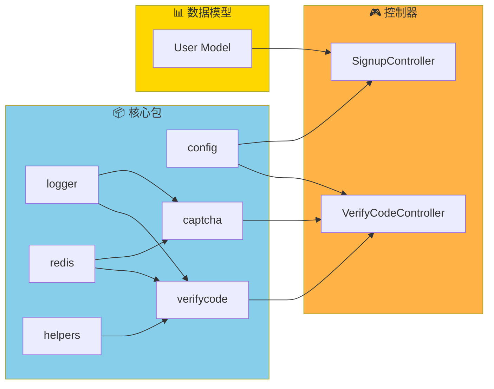

md
# 🚀 GoHub 路由流程图文档

> 完整的 API 路由架构和流程说明

---

## 📋 目录

- [1. 整体路由结构](#整体路由结构)
- [2. 健康检查路由](#健康检查路由)
- [3. 注册验证路由](#注册验证路由)
- [4. 验证码路由](#验证码路由)
- [5. 数据流架构](#数据流架构)
- [6. 错误处理](#错误处理)

---

## 整体路由结构

### 路由树



---

## 健康检查路由

### 📍 路由信息

| 属性 | 值 |
|------|-----|
| **HTTP 方法** | `GET` |
| **路径** | `/v1/` |
| **处理器** | 匿名函数 |
| **用途** | API 健康检查/状态检测 |
| **认证** | 无 |
| **速率限制** | 无 |

### 流程图



### 请求/响应示例

**请求**:
```bash
curl -X GET http://localhost:8888/v1/
```

**成功响应** (HTTP 200):
```json
{
  "message": "Hello world!"
}
```

### 代码实现

```go
v1.GET("/", func(ctx *gin.Context) {
    ctx.JSON(http.StatusOK, gin.H{
        "message": "Hello world!",
    })
})
```

---

## 注册验证路由

### 🔍 检查手机号是否存在

#### 📍 路由信息

| 属性 | 值 |
|------|-----|
| **HTTP 方法** | `POST` |
| **路径** | `/v1/auth/signup/phone/exist` |
| **处理器** | `SignupController.IsPhoneExist` |
| **请求体** | `SignupPhoneExistRequest` |
| **验证规则** | `ValidateSignupPhoneExist` |
| **认证** | 无 |
| **响应** | JSON (`{exist: boolean}`) |

#### 流程图

```mermaid
graph TD
    A["POST /v1/auth/signup/phone/exist"] --> B["SignupController"]
    B --> C["创建请求对象<br/>SignupPhoneExistRequest"]
    C --> D{["请求验证<br/>ValidateSignupPhoneExist"]}
    D -->|验证失败| E["⚠️ 返回错误<br/>HTTP 400"]
    D -->|验证成功| F["查询数据库<br/>user.IsPhoneExist"]
    F --> G{["手机号<br/>存在?"]}
    G -->|是| H["返回 exist: true"]
    G -->|否| I["返回 exist: false"]
    H --> J["✅ HTTP 200"]
    I --> J
    
    style A fill:#4a9eff
    style D fill:#ffd700
    style E fill:#ff6b6b
    style G fill:#ffd700
    style J fill:#90ee90
```

#### 请求/响应示例

**请求**:
```bash
curl -X POST http://localhost:8888/v1/auth/signup/phone/exist \
  -H "Content-Type: application/json" \
  -d '{"phone": "13800138000"}'
```

**成功响应** (HTTP 200):
```json
{
  "exist": true
}
```

**验证失败响应** (HTTP 400):
```json
{
  "error": "Validation failed",
  "message": "Phone is required"
}
```

#### 代码实现

```go
type SignupController struct {
    v1.BaseApiController
}

func (c *SignupController) IsPhoneExist(ctx *gin.Context) {
    // 1️⃣ 创建请求对象
    req := requests.SignupPhoneExistRequest{}
    
    // 2️⃣ 执行验证
    if ok := requests.Validate(ctx, &req, requests.ValidateSignupPhoneExist); !ok {
        return  // 验证失败，直接返回错误
    }
    
    // 3️⃣ 查询并返回结果
    response.JSON(ctx, gin.H{
        "exist": user.IsPhoneExist(req.Phone),
    })
}
```

---

### 📧 检查邮箱是否存在

#### 📍 路由信息

| 属性 | 值 |
|------|-----|
| **HTTP 方法** | `POST` |
| **路径** | `/v1/auth/signup/email/exist` |
| **处理器** | `SignupController.IsEmailExist` |
| **请求体** | `SignupEmailExistRequest` |
| **验证规则** | `ValidateSignupEmailExist` |
| **认证** | 无 |
| **响应** | JSON (`{exist: boolean}`) |

#### 流程图

```mermaid
graph TD
    A["POST /v1/auth/signup/email/exist"] --> B["SignupController"]
    B --> C["创建请求对象<br/>SignupEmailExistRequest"]
    C --> D{["请求验证<br/>ValidateSignupEmailExist"]}
    D -->|验证失败| E["⚠️ 返回错误<br/>HTTP 400"]
    D -->|验证成功| F["查询数据库<br/>user.IsEmailExist"]
    F --> G{["邮箱<br/>存在?"]}
    G -->|是| H["返回 exist: true"]
    G -->|否| I["返回 exist: false"]
    H --> J["✅ HTTP 200"]
    I --> J
    
    style A fill:#4a9eff
    style D fill:#ffd700
    style E fill:#ff6b6b
    style G fill:#ffd700
    style J fill:#90ee90
```

#### 请求/响应示例

**请求**:
```bash
curl -X POST http://localhost:8888/v1/auth/signup/email/exist \
  -H "Content-Type: application/json" \
  -d '{"email": "user@example.com"}'
```

**成功响应** (HTTP 200):
```json
{
  "exist": false
}
```

#### 代码实现

```go
func (c *SignupController) IsEmailExist(ctx *gin.Context) {
    // 1️⃣ 创建请求对象
    req := requests.SignupEmailExistRequest{}
    
    // 2️⃣ 执行验证
    if ok := requests.Validate(ctx, &req, requests.ValidateSignupEmailExist); !ok {
        return  // 验证失败，直接返回错误
    }
    
    // 3️⃣ 查询并返回结果
    response.JSON(ctx, gin.H{
        "exist": user.IsEmailExist(req.Email),
    })
}
```

---

## 验证码路由

### 🖼️ 获取图片验证码

#### 📍 路由信息

| 属性 | 值 |
|------|-----|
| **HTTP 方法** | `POST` |
| **路径** | `/v1/auth/verify-codes/captcha` |
| **处理器** | `VerifyCodeController.ShowCaptcha` |
| **请求体** | 无 |
| **认证** | 无 |
| **响应** | JSON (验证码 ID 和 Base64 图片) |
| **存储** | Redis |
| **有效期** | 配置化 |

#### 流程图

```mermaid
graph TD
    A["POST /v1/auth/verify-codes/captcha"] --> B["VerifyCodeController"]
    B --> C["captcha.NewCaptcha<br/>单例模式获取"]
    C --> D["生成验证码<br/>GenerateCaptcha"]
    D --> E{["生成<br/>成功?"]}
    E -->|失败| F["📝 记录错误日志<br/>logger.LogIf"]
    E -->|成功| F
    F --> G["构建响应<br/>captcha_id + captcha_image"]
    G --> H["✅ HTTP 200<br/>返回 JSON"]
    
    style A fill:#4a9eff
    style E fill:#ffd700
    style F fill:#87ceeb
    style H fill:#90ee90
```

#### 请求/响应示例

**请求**:
```bash
curl -X POST http://localhost:8888/v1/auth/verify-codes/captcha
```

**成功响应** (HTTP 200):
```json
{
  "captcha_id": "CjF6x9K2mN8pQ5vR",
  "captcha_image": "data:image/png;base64,iVBORw0KGgoAAAANSUhEUgAAAAE..."
}
```

#### 代码实现

```go
func (c *VerifyCodeController) ShowCaptcha(ctx *gin.Context) {
    // 1️⃣ 获取验证码实例并生成
    id, b64s, err := captcha.NewCaptcha().GenerateCaptcha()
    
    // 2️⃣ 记录任何发生的错误
    logger.LogIf(err)
    
    // 3️⃣ 返回验证码
    response.JSON(ctx, gin.H{
        "captcha_id":    id,
        "captcha_image": b64s,
    })
}
```

#### 内部处理流程

```mermaid
graph LR
    A["生成验证码请求"] --> B["base64Captcha<br/>驱动"]
    B --> C["创建 ID"]
    B --> D["生成图片"]
    B --> E["编码为 Base64"]
    C --> F["保存到 Redis"]
    F --> G{["环境"]}
    G -->|生产| H["过期时间: captcha.expire_time"]
    G -->|本地| I["过期时间: captcha.debug_expire_time"]
    H --> J["返回响应"]
    I --> J
    
    style F fill:#ffd700
    style G fill:#ffd700
    style J fill:#90ee90
```

---

### 📱 通过手机号发送验证码

#### 📍 路由信息

| 属性 | 值 |
|------|-----|
| **HTTP 方法** | `POST` |
| **路径** | `/v1/auth/verify-codes/phone` |
| **处理器** | `VerifyCodeController.SendUsingPhone` |
| **请求体** | `VerifyCodePhoneRequest` |
| **验证规则** | `VerifyCodePhone` |
| **认证** | 无 |
| **响应** | JSON (成功/失败) |
| **存储** | Redis |
| **外部服务** | Aliyun SMS API |

#### 流程图

```mermaid
graph TD
    A["POST /v1/auth/verify-codes/phone"] --> B["VerifyCodeController"]
    B --> C["创建请求对象<br/>VerifyCodePhoneRequest"]
    C --> D{["请求验证<br/>VerifyCodePhone"]}
    D -->|验证失败| E["⚠️ 返回错误<br/>HTTP 400"]
    D -->|验证成功| F["获取验证码实例"]
    F --> G["生成验证码"]
    G --> H{["是否<br/>调试模式?"]}
    H -->|是<br/>特定前缀| I["🔍 直接返回成功<br/>用于开发测试"]
    H -->|否| J["📤 通过 Aliyun API<br/>发送 SMS"]
    I --> K{["发送<br/>成功?"]}
    J --> K
    K -->|失败| L["❌ Abort 500<br/>Send sms fail"]
    K -->|成功| M["✅ HTTP 200<br/>Success"]
    
    style A fill:#4a9eff
    style D fill:#ffd700
    style E fill:#ff6b6b
    style H fill:#ffd700
    style K fill:#ffd700
    style L fill:#ff6b6b
    style M fill:#90ee90
```

#### 请求/响应示例

**请求**:
```bash
curl -X POST http://localhost:8888/v1/auth/verify-codes/phone \
  -H "Content-Type: application/json" \
  -d '{"phone": "13800138000"}'
```

**成功响应** (HTTP 200):
```json
{
  "code": 0,
  "message": "Success"
}
```

**失败响应** (HTTP 500):
```json
{
  "code": 500,
  "message": "Send sms fail."
}
```

#### 代码实现

```go
func (c *VerifyCodeController) SendUsingPhone(ctx *gin.Context) {
    // 1️⃣ 创建请求对象
    req := requests.VerifyCodePhoneRequest{}
    
    // 2️⃣ 验证请求
    if ok := requests.Validate(ctx, &req, requests.VerifyCodePhone); !ok {
        return  // 验证失败
    }
    
    // 3️⃣ 发送验证码
    if ok := verifycode.NewVerifyCode().SendSMS(req.Phone); !ok {
        response.Abort500(ctx, "Send sms fail.")
    } else {
        response.Success(ctx)
    }
}
```

#### 验证码发送详细流程

```mermaid
graph TD
    A["SendSMS 请求"] --> B["检查环境"]
    B --> C{["生产<br/>环境?"]}
    C -->|是| D["生成随机验证码<br/>RandomNumber"]
    C -->|否| E["使用调试码<br/>debug_code"]
    D --> F{["手机号前缀<br/>匹配?"]}
    E --> F
    F -->|匹配调试前缀| G["🔍 测试模式<br/>直接返回 true"]
    F -->|不匹配| H["准备 SMS 参数"]
    H --> I["模板: sms.aliyun.template_code<br/>签名: sms.aliyun.sign_name<br/>参数: code + min"]
    I --> J["📤 调用 Aliyun API"]
    J --> K{["API<br/>响应"]}
    K -->|成功| L["保存到 Redis<br/>Key: app.name:verifycode:phone<br/>过期时间: 配置化"]
    K -->|失败| M["📝 记录错误日志"]
    L --> N["返回 true"]
    M --> O["返回 false"]
    G --> P["🎯 最终响应"]
    N --> P
    O --> P
    
    style B fill:#ffd700
    style C fill:#ffd700
    style F fill:#ffd700
    style G fill:#87ceeb
    style J fill:#ffa500
    style K fill:#ffd700
    style L fill:#4a9eff
    style P fill:#90ee90
```

---

## 数据流架构

### 系统架构图



### 依赖关系图



---

## 错误处理

### 错误处理流程

```mermaid
graph TD
    A["请求到达"] --> B{["请求<br/>验证"]}
    B -->|验证失败| C["生成验证错误<br/>HTTP 400"]
    B -->|验证成功| D["业务处理"]
    D --> E{["执行<br/>成功?"]}
    E -->|是| F["返回成功响应<br/>HTTP 200"]
    E -->|否| G{["错误<br/>类型"]}
    G -->|业务错误| H["返回业务错误<br/>HTTP 200<br/>code != 0"]
    G -->|系统错误| I["返回系统错误<br/>HTTP 500"]
    C --> J["发送响应"]
    F --> J
    H --> J
    I --> J
    
    style B fill:#ffd700
    style C fill:#ff6b6b
    style F fill:#90ee90
    style E fill:#ffd700
    style G fill:#ffd700
    style I fill:#ff6b6b
```

### 常见错误码

| 错误码 | HTTP 状态 | 说明 | 解决方案 |
|--------|----------|------|---------|
| 400 | 400 Bad Request | 请求验证失败 | 检查请求参数是否正确 |
| 500 | 500 Internal Error | 服务器内部错误 | 查看服务器日志 |
| SMS_FAIL | 500 | 短信发送失败 | 检查 Aliyun 配置和网络 |
| DB_ERROR | 500 | 数据库错误 | 检查数据库连接 |
| REDIS_ERROR | 500 | Redis 错误 | 检查 Redis 连接 |

---

## 📊 配置参数参考

### 验证码配置

```yaml
app:
  name: "gohub"              # 应用名称（用于 Redis Key 前缀）
  env: "local"               # 环境: local, testing, production

captcha:
  expire_time: 10            # ⏱️ 生产环境过期时间 (分钟)
  debug_expire_time: 60      # ⏱️ 本地开发过期时间 (分钟)
  height: 60                 # 📏 验证码图片高度
  width: 200                 # 📏 验证码图片宽度
  length: 4                  # 🔢 验证码位数
  max_skew: 0.7             # 🎯 最大倾斜度
  dot_count: 80             # 🎨 干扰点数量
  testing_key: "test"        # 🔑 测试模式密钥

verifycode:
  expire_time: 10            # ⏱️ 生产环境过期时间 (分钟)
  debug_expire_time: 60      # ⏱️ 本地开发过期时间 (分钟)
  code_length: 6             # 🔢 验证码长度
  debug_code: "123456"       # 🔑 本地调试码
  debug_phone_prefix: "13"   # 📱 调试手机号前缀
  debug_email_suffix: "@test.com"  # 📧 调试邮箱后缀

sms:
  aliyun:
    access_key_id: "xxx"           # 🔐 Aliyun 访问密钥 ID
    access_key_secret: "xxx"       # 🔐 Aliyun 访问密钥
    endpoint: "dysmsapi.aliyuncs.com"  # 🌐 Aliyun 端点
    sign_name: "GoHub"             # 📛 短信签名
    template_code: "SMS_xxx"       # 📝 短信模板代码
```

---

## 🎯 总结

### 路由功能总览

| 功能 | 路由 | HTTP | 用途 |
|------|------|------|------|
| 健康检查 | `/v1/` | GET | 检测 API 服务状态 |
| 手机号验证 | `/v1/auth/signup/phone/exist` | POST | 检查注册时手机号是否已使用 |
| 邮箱验证 | `/v1/auth/signup/email/exist` | POST | 检查注册时邮箱是否已使用 |
| 获取验证码 | `/v1/auth/verify-codes/captcha` | POST | 获取图片验证码用于交互 |
| 发送验证码 | `/v1/auth/verify-codes/phone` | POST | 通过手机号发送 SMS 验证码 |

### 核心特性

✅ **RESTful API 设计** - 标准的 REST 风格  
✅ **模块化架构** - 清晰的控制器和服务层分离  
✅ **请求验证** - 自动的请求数据验证  
✅ **统一响应** - 一致的 JSON 响应格式  
✅ **错误处理** - 完整的异常处理机制  
✅ **缓存支持** - 使用 Redis 存储临时数据  
✅ **SMS 集成** - 阿里云短信服务集成  
✅ **验证码生成** - 自动生成和验证图片验证码  
✅ **调试模式** - 开发环境友好的测试支持  

---

## 🔗 相关文件

- 📄 [routes/api.go](./routes/api.go) - 路由定义
- 📄 [app/http/controllers/api/v1/auth/](./app/http/controllers/api/v1/auth/) - 控制器
- 📄 [app/requests/](./app/requests/) - 请求验证
- 📄 [app/response/](./app/response/) - 响应处理
- 📄 [pkg/captcha/](./pkg/captcha/) - 验证码包
- 📄 [pkg/verifycode/](./pkg/verifycode/) - 验证码管理
- 📄 [pkg/sms/](./pkg/sms/) - SMS 服务

---

*📅 文档生成时间: 2026-06-18*  
*🏷️ 项目: GoHub - Go 语言 Hub 应用*  
*🔖 版本: v1.0*
